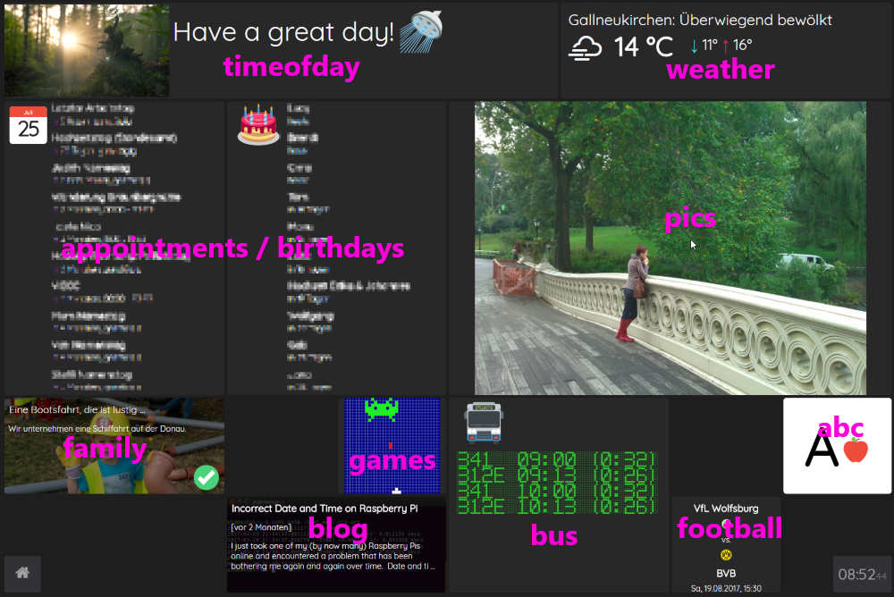

# dashydash

A dashboard application intended for home use. It keeps your appointments, family pictures, bus connections, ... at glance.

## Installation

* Install [Node.js](https://nodejs.org/en/download/)
```bash
# On a RaspberryPi (run as root)
curl -sL https://deb.nodesource.com/setup_11.x | bash -
apt-get install -y nodejs
```
* Clone this repository  
`git clone https://github.com/z1c0/dashydash`
* Install [gulp](https://gulpjs.com/) globally
```
sudo npm install -g gulp
```
* `npm install`
* Run with `gulp`

### Troubleshooting
On a **RaspberryPi**, if you encounter this error: `sass/context.h: No such file or directory`, try running `LIBSASS_EXT="no" npm install`.

## Technologies

The application is implemented using **Node.js** and **React**.

## Modules

These are some of the mentioned modules displayed on the dashboard. A lot of
them are specific and tailored to my family's needs, but feel free to extend them or add your own.

Here's an example of how this dashboard looks like.



### abc

This lets my 4 year old learn the alphabet in a playful way. It displays capital letters and images of things starting with this letter.

###  appointments / birthdays

Displays a list of upcoming appointments or birthdays fetched from Google calendars using the [npm ical package](https://www.npmjs.com/package/ical).

### blog

This module displays the title, a short description and the date of my latest blog post. It acts as a subtle reminder to come up with a new post should I let too much time pass without one.

### bus

The bus schedule from home to work. Very useful.

### football

Displays time and venue of the upcoming game of my favorite football team [Borussia Dortmund](http://bvb.de).

### games

These are a couple of 32x32 pixel animations reminding of retro computer games. I actually built this as a testing environment for [another project](https://wolfgang-ziegler.com/blog/arduino-led-picture-frame) but considered it way too nice to be kept in hiding.

### news

This one cycles through a list of news head lines and pictures taken from [newsapi.org](https://newsapi.org/).

### pics

This is my favorite module by far. It looks for a special album in my Google photos collectionb and displays its pictures. That way, I only have to add my favorite new photos to this album and I automatically seen them on the dashboard. Awesome!

### weather

Using data from [openweathermap.org](http://openweathermap.org/), this module displays weather information for a given location.


## Boards

These modules are arranged in configurations called *Boards*. Arranging these boards is simply a matter of editing a **JSON configuration file**. The layout in the picture above e.g. is configured like this (the numbers between the square brackets represent *top / left / width / height* position in a 8 x 6 grid.

```js
"main" : {
  "modules" : {     
    "timeofday" :    [ 1, 1, 5, 1 ],
    "appointments" : [ 1, 2, 2, 3 ],
    "birthdays" :    [ 3, 2, 2, 3 ],
    "pics" :         [ 5, 2, 4, 3 ],
    "games" :        [ 4, 5, 1, 1 ],
    "news" :         [ 1, 5, 2, 1 ],
    "blog" :         [ 3, 6, 2, 1 ],
    "weather" :      [ 6, 1, 3, 1 ],
    "bus" :          [ 5, 5, 2, 2 ],
    "abc" :          [ 8, 5, 1, 1 ],
    "football" :     [ 7, 6, 1, 1 ]
  }
}
```

So, displaying a component (e.g. pictures) full screen can be done like this:

```js
"photos" : {
  "modules" : {     
    "pics" : [ 1, 1, 8, 6 ]
  }
}  
```

Switching between these layouts ("boards") happens automatically after a certain amount of time or - of course - manually.

## More?
This [blog post](https://wolfgang-ziegler.com/blog/family-dashboard) gives some more detail on how the dashboard (both hardware and software) were made.

## Get Engaged!
A lot of these modules or their functionality are tailored to personal needs and use cases. However, if you have ideas, suggestions or feedback do not hesitate to contact me.  
Of course, **pull requests** are welcome anytime!

